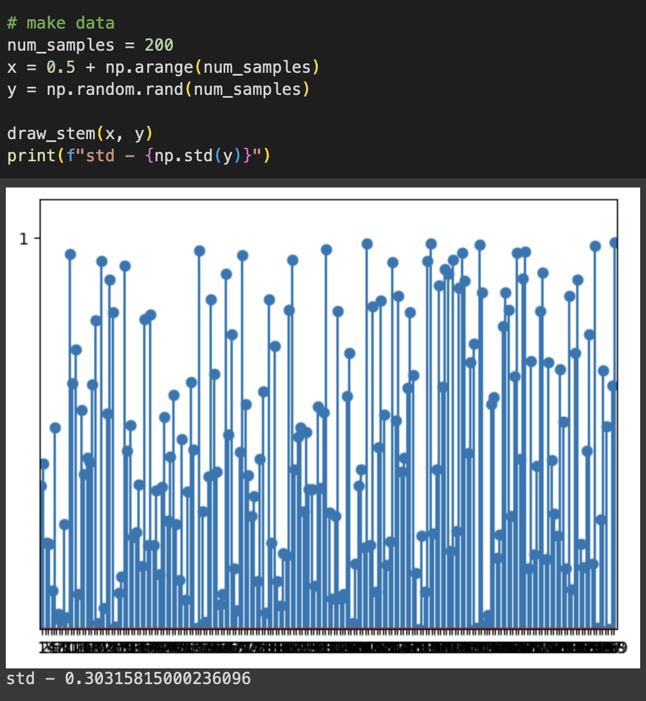
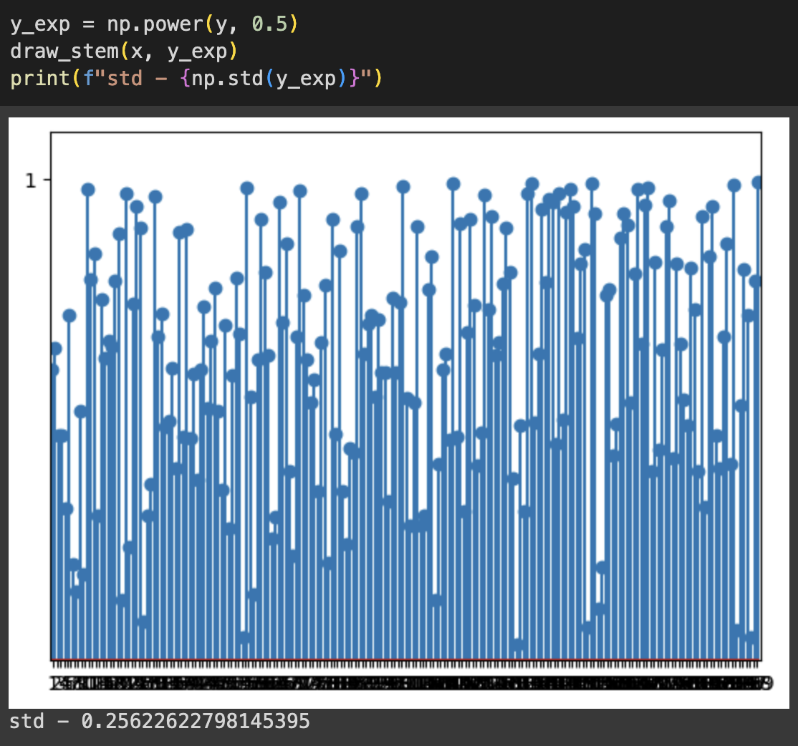

Here is post #1 in the series of Random Notes on MCL. Why am I doing that? It is simple. MCL algorithm has a lot of techniques that can make it better for certain circumstances. Despite that techniques are known, they are kind of hidden. Under the tons of literature, under badly indexed papers and so on. Figuring out how to find the right motion model is incomparably harder the to find latest SOTA on semantic segmentation. 

So why not make that world a little better and share what I’ve found? Let’s get into that.

## Sensor Model

We start today by discussing MCL’s sensor model. The sensor model is the way to tell how good your current sensor measurement is relative to a predefined map. That “goodness” will be used to assign every particle a score (or weight, I’ll use that interchangeably). Based on the score we can decide which particle represents the current robot pose better.

Building the correct sensor model is not that easy due to the following reasons:

1. environment != map: here I mean semi-static environments like apartments or the offices where environment can change slightly (or not!) every several days.
2. sensor noise
3. dynamic objects

So what do we get:  we have a model that tells how well are we matching the map, but due to the world's imperfection, we cannot believe that model fully. So what do we do?

1. Improve your model sensor model so it describes the world better (easy to say, I know)
2. Make the model less confident about its prediction.

Let’s go deeper with the second point. 

## Decrease sensor model confidence

The solution here is pretty simple: according to Thrun’s Probabilistic Robotics you can just exponentiate your particle weights’:

$
w = w^{conf}
$

`w `- particle weight

`conf` - confidence score, must lie in `[0;1]` interval

So why does that simple procedure make our sensor model less confident? It is all about how exponentiating works, let’s look at an example:

Here we see an example of a particle weights distribution (before normalization) with a standard deviation of 0.303

Here is what happens when we exponentiate that weight with, let’s say, 0.5:

Weight became close to each other, which is visible by looking at both the graph and the standard deviation.

You increase all the values (we assume they are in the `[0;1]` range), but values with a lower magnitude are being increased more, than the values with a higher magnitude.

What does that mean for our dear particles and their score? As particle scores now are closer to each other, it will be more difficult for AMCL to choose what particles to drop and what to leave during the resampling step. 

So it leaves a broader range of particles alive after resampling which mean that more pose hypothesis can be proven correct (which is both good and evil, but that is a different story).